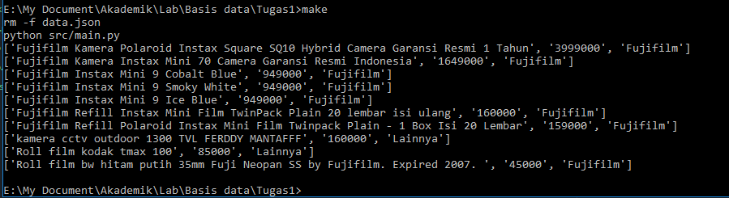

<h1 align="center">
  <br>
  Web Scraper Data Harga Kamera Analog
</h1>

<h2 align="center">
  Teresa - 13516133
  <br>
</h2>

### Description

Web scraper yang mengambil data berupa Nama, Harga dan Merek Kamera Analog dari www.bukalapak.com . Mungkin akan diupdate.

### Specifications

1. Lakukan data scraping dari sebuah laman web untuk memeroleh data atau informasi tertentu __TANPA MENGGUNAKAN API__

2. Daftarkan judul topik yang akan dijadikan bahan data scraping pada spreadsheet berikut: [Topik Data Scraping](http://bit.ly/TopikDataScraping). Usahakan agar tidak ada peserta dengan topik yang sama. Akses edit ke spreadsheet akan ditutup tanggal 10 Mei 2018 pukul 20.00 WIB

3. Dalam mengerjakan tugas 1, calon warga basdat terlebih dahulu melakukan fork project github pada link berikut: https://github.com/wargabasdat/Seleksi-2018/tree/master/Tugas1. Sebelum batas waktu pengumpulan berakhir, calon warga basdat harus sudah melakukan pull request dengan nama ```TUGAS_SELEKSI_1_[NIM]```

4. Pada repository tersebut, calon warga basdat harus mengumpulkan file script dan json hasil data scraping. Repository terdiri dari folder src dan data dimana folder src berisi file script/kode yang __WELL DOCUMENTED dan CLEAN CODE__ sedangkan folder data berisi file json hasil scraper.

5. Peserta juga diminta untuk membuat Makefile sesuai template yang disediakan, sehingga program dengan gampang di-_build_, di-_run_, dan di-_clean_

``` Makefile
all: clean build run

clean: # remove data and binary folder

build: # compile to binary (if you use interpreter, then do not implement it)

run: # run your binary

```

6. Deadline pengumpulan tugas adalah __15 Mei 2018 Pukul 23.59__

7. Tugas 1 akan didemokan oleh masing-masing calon warga basdat

8. Demo tugas mencakup keseluruhan proses data scraping hingga memeroleh data sesuai dengan yang dikumpulkan pada Tugas 1

9. Hasil data scraping ini nantinya akan digunakan sebagai bahan tugas analisis dan visualisasi data

10. Sebagai referensi untuk mengenal data scraping, asisten menyediakan dokumen "Short Guidance To Data Scraping" yang dapat diakses pada link berikut: [Data Scraping Guidance](http://bit.ly/DataScrapingGuidance)

11. Tambahkan juga gitignore pada file atau folder yang tidak perlu di upload, __NB : BINARY TIDAK DIUPLOAD__

12. JSON harus dinormalisasi dan harus di-_preprocessing_
```
Preprocessing contohnya :
- Cleaning
- Parsing
- Transformation
- dan lainnya
```

13. Berikan README yang __WELL DOCUMENTED__ dengan cara __override__ file README.md ini. README harus memuat minimal konten :
```
- Description
- Specification
- How to use
- JSON Structure
- Screenshot program (di-upload pada folder screenshots, di-upload file image nya, dan ditampilkan di dalam README)
- Reference (Library used, etc)
- Author
```

### How to Use

1. Install Python dan library BeautifulSoup ke dalam komputer
2. Jalankan program dengan menjalankan Makefile
3. Untuk menghentikan program tekan Ctrl-C

### JSON Structure

Untuk sementara data disimpan dalam data.json dan struktur JSON adalah sebagai berikut:
```
{"Kamera":
  [
    {
      "Nama": "Fujifilm Kamera Polaroid Instax Square SQ10 Hybrid Camera Garansi Resmi 1 Tahun",
      "Harga": "3999000",
      "Merek": "Fujifilm"
    },
    {
      "Nama": "Fujifilm Kamera Instax Mini 70 Camera Garansi Resmi Indonesia",
      "Harga": "1649000",
      "Merek": "Fujifilm"
    },
    {
      "Nama": "Fujifilm Instax Mini 9 Cobalt Blue",
      "Harga": "949000",
      "Merek": "Fujifilm"
    }
  ]
}
```

### Screenshots

Program dijalankan dengan Makefile



### Reference

1. Library BeautifulSoup, time, dan json
2. Stackoverflow
3. Python documentation

### Author

Teresa - 13516133
